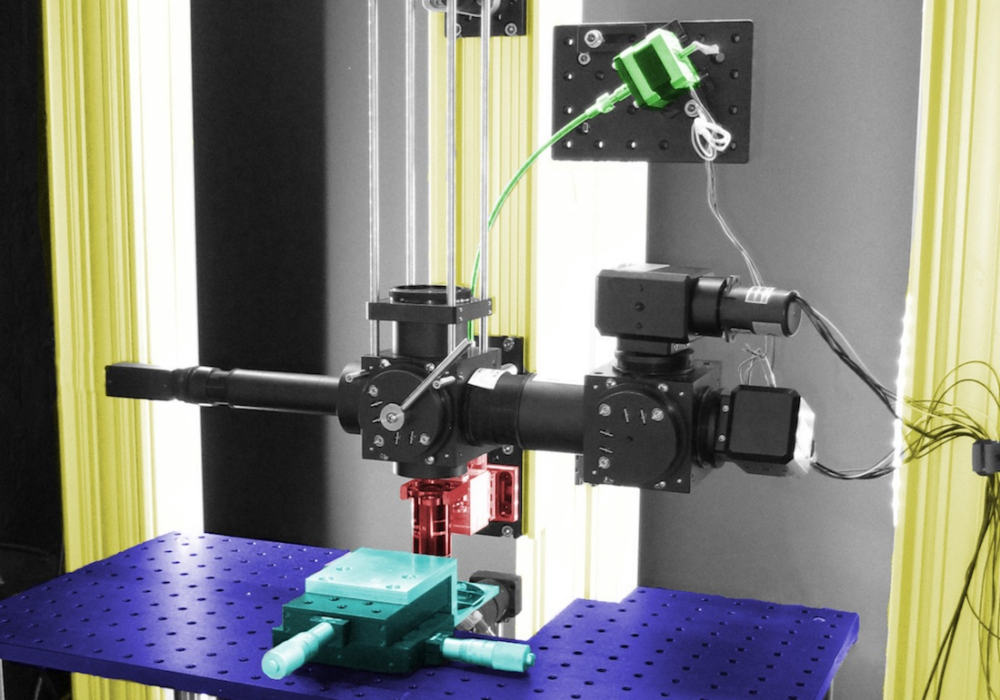

<h1>OpenStage</h1>
<i>Open source microscope stage controller</i>
 

OpenStage is a hardware and software solution for cheaply motorizing a microscope stage. The system is accurate enough even for demanding tasks, such as fine focus operations on a 2-photon microscope. The characteristics of the system and important build information are described in our <a href="http://www.plosone.org/article/info%3Adoi%2F10.1371%2Fjournal.pone.0088977">PlosONE paper</a>. We achieved absolute unidirectional positioning accuracy and repeatability better than 0.1 μm in Z. Bidirectional positioning accuracy is in the range of 0.5 μm to 0.75 μm in Z. Positioning repeatability in X and Y is better than 1 μm. Minimum incremental motion is 0.04 μm in Z and 0.1 μm in X and Y. These values compare favorably to many commercial actuators costing several times as much as our system.

Our system costs roughly $1000 for three axes (controller + motors + motor coupling hardware). Up to four axes are possible. Commercial solutions cost in the region of $5,000 to $10,000. None of these costs include structural components such as bread-boards, linear translation stages, construction posts, etc, since all of this hardware is required no matter what motor solution is used. The breakdown of the costs is as follows:

* Motors and couplers are $100 to $200 per axis.
* Costs for micrometers, which act as the gear mechanism, are $80 to $150 per axis.
* A 4 axis controller unit can be assembled for under $500.

The cost savings come from the fact that we are using regular stepper motors instead of expensive linear actuators or servos. Further, the gears in our system are micrometers, which are easy to source and can even be bought at a discount from E-Bay. The main trade off compared to commercial systems is bulk, since connecting a stepper motor to a micrometer requires a relatively long (at least 8" or so) flexible shaft. However, if you can find a suitable leadscrew or rack and pinion gear as a substitute for the micrometer then the system will become more compact. A second trade off is that the controller unit does not have a feedback mechanism (encoders) for tracking position; position is inferred by counting the number of steps taken by the motors. In practice, this is not an issue as a properly assembled stage that is not driven beyond its operating limits will not lose position. Our system has maintained very high accuracy with zero maintanance. 

The stand-alone controller is based around an Arduino Mega. You can also build a single-axis controller around an Arduino Uno for under $100, but this can't accept a PS3 gamepad as there isn't sufficient SRAM on this device. The controller communicates with a PC via serial or virtual serial (USB) ports. An external LCD display and hand-held controller can also, optionally, be added. There is now a PCB into which all components can easiliy be connected. Instructions of assembly with the first version of the PCB are in the repository. There is a new (untested) version of the PCB <a href="https://oshpark.com/shared_projects/8WlR0lh0">here</a>. I have a limited number of of the first version still available to send out (contact me via github).

<h2>Arduino Mega ADK</h2>
Users report that if the <a href="https://www.arduino.cc/en/Main/ArduinoBoardMegaADK">Arduino Mega ADK</a> is used, the project will run out of the box without the USB host shield.
